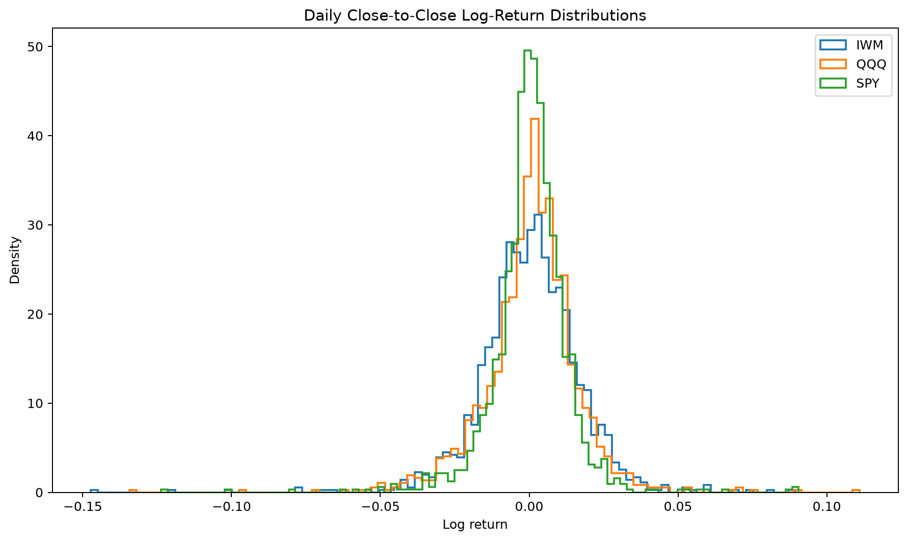
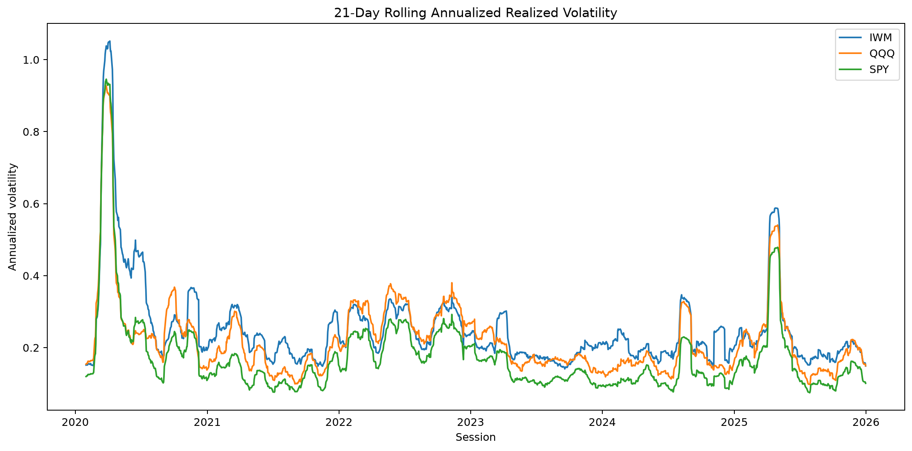
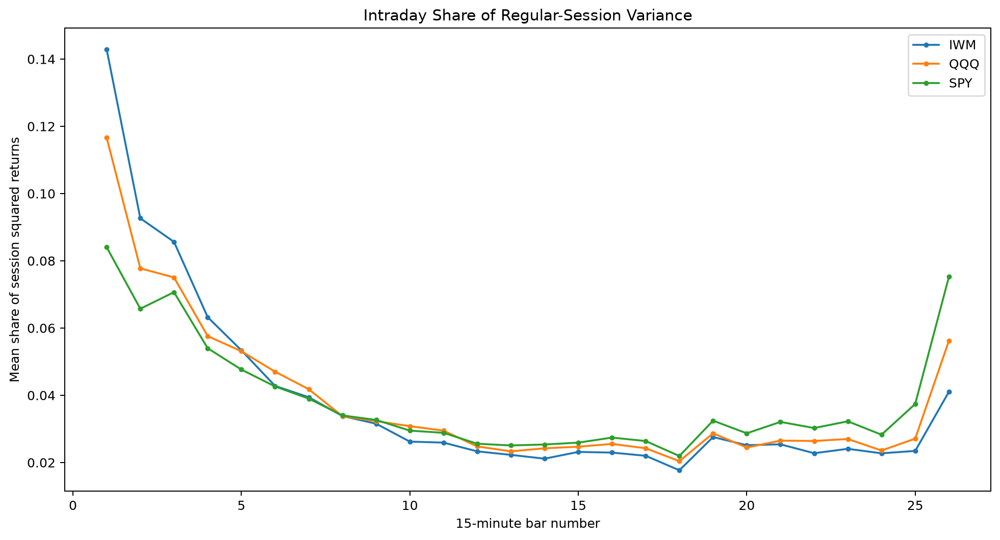
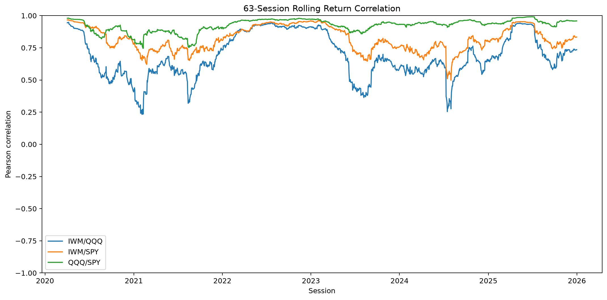
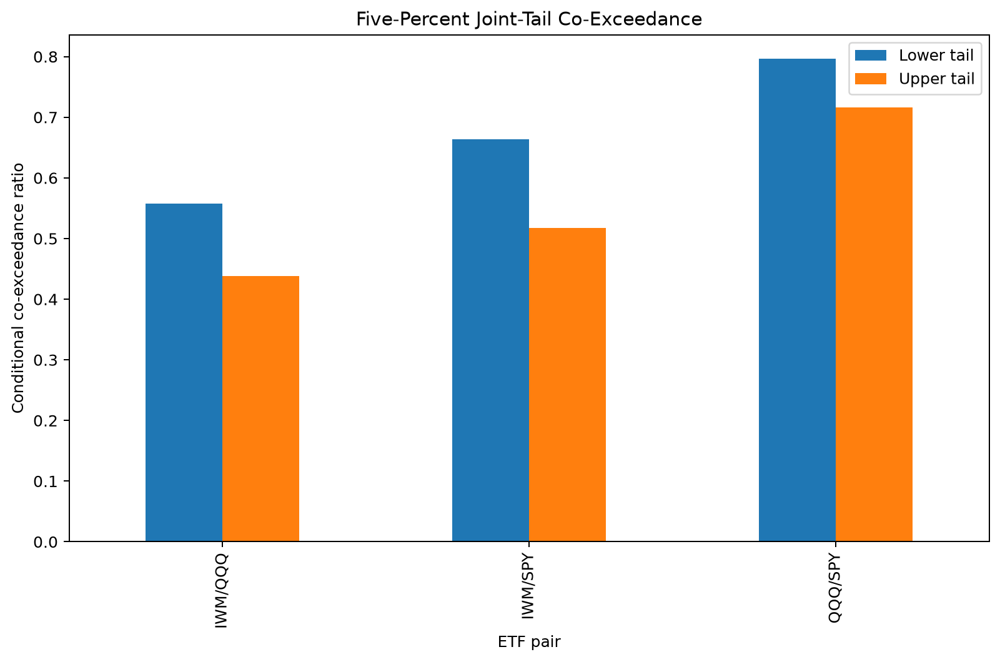

# Day 05 — Data, Returns and Stylized-Fact Findings

- **Generated:** 2026-07-22T23:43:23.582766+00:00
- **Development period:** 2020-01-02 through 2025-12-31
- **Primary universe:** SPY, QQQ and IWM
- **Primary frequency:** 15-minute regular-session SIP bars
- **Locked final test:** Not accessed

## 1. Executive findings

The Day 05 evidence rejects a simple independent Gaussian-return model.

- **IWM** had the highest daily standard deviation at approximately **1.6912%**.
- All three ETFs displayed negative daily skewness.
- **SPY** had the largest daily excess kurtosis at approximately **14.39**.
- The largest observed three-standard-deviation frequency multiple was **5.65×** the Gaussian benchmark for **SPY**.
- Raw 15-minute return autocorrelation was economically small, while absolute and squared-return autocorrelation was substantially larger.
- Daily Ljung–Box tests rejected serial independence, especially for absolute and squared returns.
- Return dependence varied through time and increased during stressed volatility conditions.
- Event-bar conservation was verified, but the available one-minute trade sample was not sufficient for statistical comparison.

These results support volatility-aware risk management and regime analysis. They do not by themselves demonstrate a profitable trading signal.

## 2. Return definitions

Simple return:

\[
R_t = \frac{P_t}{P_{t-1}}-1.
\]

Log return:

\[
r_t = \log P_t-\log P_{t-1}.
\]

Intraday bar returns exclude overnight transitions. Overnight returns were calculated separately as:

\[
r_d^{ON}
=
\log O_d-\log C_{d-1}.
\]

The daily decomposition was numerically reconciled:

\[
r_d^{CC}
=
r_d^{ON}
+
r_d^{RS}.
\]

## 3. Daily return distributions

| symbol | observations | mean | standard_deviation | skewness | excess_kurtosis | jarque_bera_pvalue |
| --- | --- | --- | --- | --- | --- | --- |
| IWM | 1507 | 0.000312709 | 0.0169121 | -0.733941 | 8.18366 | 0 |
| QQQ | 1507 | 0.000718969 | 0.0160343 | -0.401831 | 7.69887 | 0 |
| SPY | 1507 | 0.000549975 | 0.0131235 | -0.639356 | 14.3915 | 0 |

Jarque–Bera p-values were effectively zero for the development sample. Because the sample is large, the economic interpretation relies on skewness, excess kurtosis, empirical quantiles and tail frequencies rather than the p-value alone.

## 4. Empirical tail behaviour

| symbol | two_sided_count | empirical_two_sided_rate | normal_two_sided_rate | empirical_to_normal_ratio |
| --- | --- | --- | --- | --- |
| IWM | 18 | 0.0119443 | 0.0026998 | 4.42413 |
| QQQ | 20 | 0.0132714 | 0.0026998 | 4.9157 |
| SPY | 23 | 0.0152621 | 0.0026998 | 5.65306 |

The Gaussian two-sided probability beyond three standard deviations is approximately 0.27%. The observed frequencies were several times larger.

This finding discourages reliance on an unadjusted Gaussian VaR model and supports later Historical Simulation, Filtered Historical Simulation and conditional-volatility comparisons.

## 5. Serial dependence and volatility clustering

### Intraday lag-one autocorrelation

| symbol | transformation | pair_count | autocorrelation |
| --- | --- | --- | --- |
| IWM | absolute | 36048 | 0.340459 |
| IWM | raw | 36048 | 0.0125741 |
| IWM | squared | 36048 | 0.336074 |
| QQQ | absolute | 36048 | 0.331817 |
| QQQ | raw | 36048 | 0.0167868 |
| QQQ | squared | 36048 | 0.27234 |
| SPY | absolute | 36048 | 0.377101 |
| SPY | raw | 36048 | 0.00756121 |
| SPY | squared | 36048 | 0.26352 |

Raw return dependence was small. The larger dependence in absolute and squared returns provides direct evidence of volatility clustering.

### Daily Ljung–Box evidence at lag 20

| symbol | transformation | ljung_box_statistic | ljung_box_pvalue | reject_at_5pct |
| --- | --- | --- | --- | --- |
| IWM | absolute | 1150.06 | 3.56182e-231 | True |
| IWM | raw | 110.19 | 1.8133e-14 | True |
| IWM | squared | 1236.21 | 1.33746e-249 | True |
| QQQ | absolute | 1332.44 | 3.33047e-270 | True |
| QQQ | raw | 160.096 | 7.1962e-24 | True |
| QQQ | squared | 1047.97 | 2.27431e-209 | True |
| SPY | absolute | 2504.23 | 0 | True |
| SPY | raw | 253.707 | 2.04074e-42 | True |
| SPY | squared | 1963.59 | 0 | True |

Rejection in raw returns must not automatically be interpreted as exploitable directional predictability. Crisis observations, volatility clustering and regime shifts can also affect these tests.

## 6. Realized volatility

\[
RV_d
=
\sum_{k=1}^{N_d}
r_{d,k}^2.
\]

Annualized daily realized volatility was calculated as:

\[
\sigma_{d,ann}
=
\sqrt{252RV_d}.
\]

| symbol | sessions | median_annualized_total_rv | p95_annualized_total_rv | maximum_annualized_total_rv | median_overnight_variance_share | mean_jump_variation_share |
| --- | --- | --- | --- | --- | --- | --- |
| IWM | 1508 | 0.193096 | 0.465164 | 2.19624 | 0.188583 | 0.133276 |
| QQQ | 1508 | 0.173035 | 0.416316 | 1.95743 | 0.193278 | 0.130409 |
| SPY | 1508 | 0.125078 | 0.335572 | 2.01616 | 0.219993 | 0.12681 |

The results justify later EWMA, GARCH and asymmetric GJR-GARCH comparisons.

## 7. Intraday seasonality

Variance, volume and trade activity were not uniform across the session. This affects:

- volatility scaling;
- execution-cost assumptions;
- signal timing;
- stop and threshold calibration;
- interpretation of opening and closing bars.

The project will not assume that all 15-minute intervals have identical risk.

## 8. Cross-asset dependence

| symbol_a | symbol_b | observations | pearson_correlation | spearman_correlation | kendall_tau |
| --- | --- | --- | --- | --- | --- |
| IWM | QQQ | 1507 | 0.766985 | 0.686391 | 0.507569 |
| IWM | SPY | 1507 | 0.870232 | 0.820819 | 0.635526 |
| QQQ | SPY | 1507 | 0.93622 | 0.91421 | 0.760275 |

The strongest full-sample Pearson dependence was observed for **QQQ/SPY** at approximately **0.936**.

Pearson, Spearman and Kendall measures were reported separately because linear correlation does not fully describe dependence.

Dependence was time-varying. Static full-sample correlation must therefore be treated as a summary rather than an invariant parameter.

## 9. Finite-threshold joint-tail dependence

| symbol_a | symbol_b | lower_joint_rate | upper_joint_rate | lower_coexceedance_ratio | upper_coexceedance_ratio |
| --- | --- | --- | --- | --- | --- |
| IWM | QQQ | 0.0278699 | 0.0218978 | 0.557399 | 0.437956 |
| IWM | SPY | 0.0331785 | 0.0258792 | 0.66357 | 0.517585 |
| QQQ | SPY | 0.0398142 | 0.0358328 | 0.796284 | 0.716656 |

These are finite-threshold co-exceedance measures and are not presented as asymptotic copula tail-dependence coefficients.

Correlation and joint-tail dependence may help generate pair candidates, but neither establishes cointegration or profitable mean reversion.

## 10. Time bars versus event bars

| sampling_method | project_role | decision | reason |
| --- | --- | --- | --- |
| 15-minute time bars | primary research frequency | retain | Complete six-year SIP development coverage, exact exchange-calendar validation and sufficient observations. |
| dollar bars | future event-bar experiment candidate | implementation verified; statistical acceptance deferred | Dollar bars normalize economic activity, but the available trade sample spans only one minute. |
| tick bars | engineering robustness | implementation verified only | Trade-count conservation is verified, but no representative multi-session sample is currently available. |
| volume bars | engineering robustness | implementation verified only | Volume conservation is verified, but the one-minute sample cannot support distributional conclusions. |

The event-bar engine preserved:

- every trade;
- every share;
- total dollar notional;
- whole-trade threshold crossings;
- the final residual bar.

The current trade sample contained only one minute of SPY IEX observations. It was therefore classified as an engineering smoke test, not statistical evidence.

The controlled decision is:

- retain 15-minute SIP time bars as the primary project frequency;
- use 30-minute and 60-minute time bars for robustness;
- retain dollar bars as the preferred future event-bar candidate;
- defer event-bar acceptance until representative multi-session trade data is available.

## 11. Implications for Days 06–10

1. Trend models should be tested on 15-minute bars first.
2. Parameters should not be justified by Gaussian-return assumptions.
3. Volatility-scaled thresholds and regime diagnostics are empirically justified.
4. Candidate pairs require economic justification and cointegration testing; correlation alone is insufficient.
5. Opening and closing periods may require separate execution and risk treatment.
6. Dollar bars remain optional and must not delay the CQF-core strategy work.
7. All estimation and model selection remain confined to the development sample.

## 12. Limitations

- Day 05 is descriptive and does not establish trading profitability.
- Formal tests can be dominated by large samples and crisis observations.
- Static dependence summaries may conceal regime changes.
- The event-bar sample is too short for statistical inference.
- Bid–ask spread and Level-1 quote effects are analysed later.
- The locked 2026 final-test period was not accessed.

## 13. Generated figures

- [daily_return_distributions.png](figures/daily_return_distributions.png)
- [rolling_realized_volatility.png](figures/rolling_realized_volatility.png)
- [intraday_variance_seasonality.png](figures/intraday_variance_seasonality.png)
- [rolling_dependence_63d.png](figures/rolling_dependence_63d.png)
- [tail_coexceedance_5pct.png](figures/tail_coexceedance_5pct.png)
